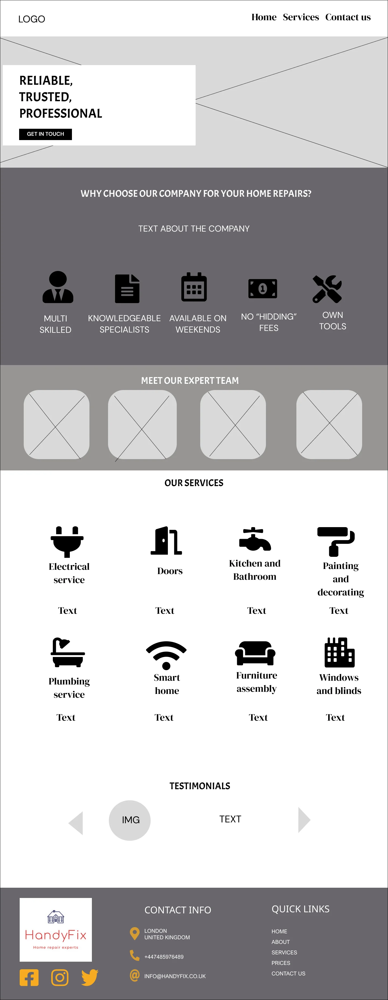
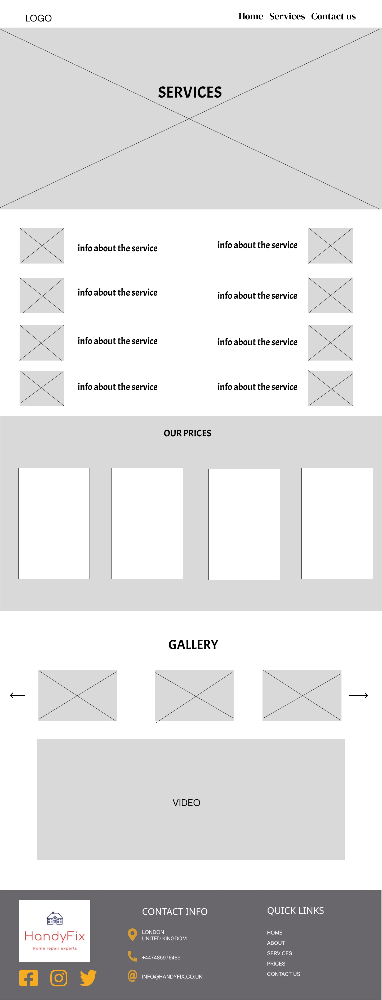
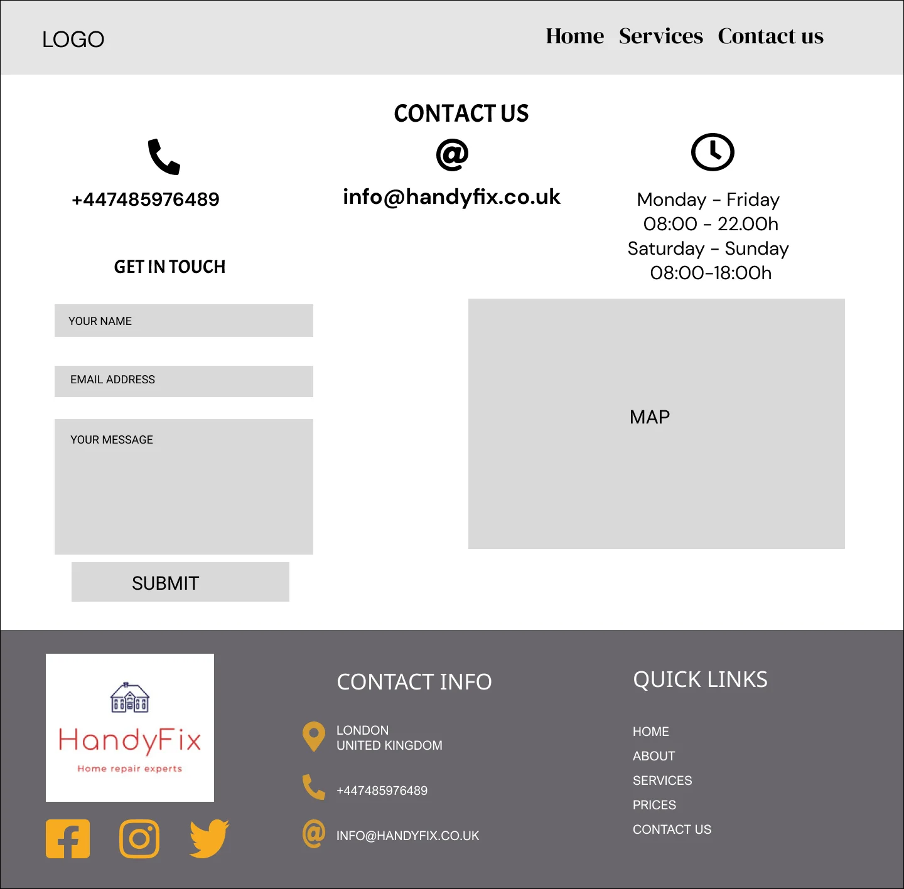

# HandyFix

<!--add mock up picture here-->

---

## About

HandyFix is a reliable and responsive website about the company that provides handyman services for people in and around London. The site will target individuals who need one or more of these services.

A handyman business typically offers a wide range of services related to home maintenance, repairs, and improvements. Some services offered by the handyman business include general repairs, carpentry, painting, plumbing, electrical repairs, etc.

The user will be provided with the essential information and pricing about the services, as well as a gallery that will allow them to see the previous projects that have been done by the highly skilled and experienced specialists at HandyFix. All this will give the user the confidence that they are making the right decision by choosing to get in touch.

<!--add link to the live website here***Click**[here]()**to view the live website.***-->

## User Experiences

### **User Stories**

#### **First-time visitor goals:**

- As a first-time visitor, I want to easily understand the main purpose of the site and learn more about the company.

- As a first-time visitor, I want to be able to easily navigate through the site to find content.

- As a first-time visitor, I want to look for testimonials to understand what their users think of them and see if they are trusted.

- As a first-time visitor, I want to locate their social media links to determine how trusted and known they are.

- As a first-time visitor, I want to have an insight into the company and where they operate.

- As a first-time visitor, I want to be able to see what services they offer.

- As a first-time visitor, I want to be able to see what the pricing is for each service or hourly.

- As a first-time visitor I want to see what is included in the price.

- As a first-time visitor I want to know how to get in touch with the company.

- As a first-time visitor I want to see pictures of their previous project/work.

- As a first-time visitor I want to see what hours the company operates at.

- As a first-time visitor I want to be able to see and click on the links to their social media pages.

- As a first-time visitor I want to easily navigate through the site without becoming overwhelmed with too much information.

- As a first-time visitor I want to see where the company is located.

#### **Business Goals:**

- As an owner, I want to generate new business by getting users to contact the company.

- As an owner, I want users to easily navigate through the site and at the end be confident enough to contact the company.

- As owner, I want the site to show the motto of "quality over quantity" in terms of the information that is on display.

- As owner, I want to encourage users to go to our social media pages which will help boost the profile of the company.

- As owner, I want the site to be responsive so users on any platform can successfully navigate the site.

### **Strategy**

This project is to design and create a static website that is done mainly through HTML and CSS.

The main goal of the website is to get potential customers to use one or more of the provided services. The site will help users learn about the range of services offered by the handyman, including repairs, maintenance, and installations. This helps users understand if the handyman can address their specific needs. The website.

By making the site fully responsive, the site aims to be easily accessible no matter which platform the user is viewing the site on.

### **Scope**

The main features that will be implemented into the website will be included on four separate pages. The design of the website should look professional and trustworthy at the same time simple and eye-catching. In help to create this design will be carefully selected color palette and fonts.

The site will have an "About section" where users can learn some more information about the company. This will help build more trust in users. We will provide contact details, making it easy for users to get in touch. We will showcase previous work through photos, testimonials, and a video. This will help users gauge the handyman`s skill and quality of work. Users can find out if the handymen serves their geographical area, ensuring that they are accessible to potential customers. The website will show pricing information. This transparency can help users budget for their home improvement projects.

### **Structure**

The structure of the website is to have four separate pages. It is designed to be mobile-first design. Every page will have a header and footer.

The home page will be made of five sections, providing essential information. The sections on the page will be Header, Why choose our company for your home repair?, Our services, Testimonials, and Footer. The header will consist of the company logo and a navigation section which will be a list with a hamburger icon for smaller devices and then be a text on the desktop. In the "Why choose our company for your home repair?" section will be included relevant information about the company, photos of the handyman team, and icons that will show the main reasons to choose the company. In the "Our services" section will be named services, provided by the handymen, with icons that will make it easy to identify the service. The icons will be clickable and will send users to the Service page. The testimonial section will provide reviews from customers, who already used the services. This will help potential customers more easily decide to get in touch with the company. The footer will include the company logo, contact information with icons for easy identification of the information, quick links to the pages on the website, and social media links, so users can follow company pages on the provided platforms.

The service page will be made up of five sections- header with logo and navigation bar; services section where will be added photo to relevant service with specific information about what the service includes, price section with information about the prices; gallery section where users can see previous work done by handymen; and footer section with contact information and quick links.

The contact page will be made up of three sections. There will be a header section with a navigation bar and logo; contact information which will include phone number, email address, office opening hours, get in touch form that can be filled and submitted by users, map- so that can users see where the company office is based; and footer with contact information and quick links.

The success page will be made of three sections. There will be a header section with a navigation bar and logo, section with a message that will show users that they successfully complete the form, and footer with contact information and quick links.

### **Skeleton**

To create the wireframes, the design tool Figma. There were nine frames created- for each page and for three devices- desktop, tablet, and mobile. They were created to help establish a clear and organized structure for the website. They provide an outline of the layout how elements will be arranged on the screen, and how the interface will adopt the different screen sizes and devices, laying the foundation for responsive design.

Desktop

Tablet

Mobile

